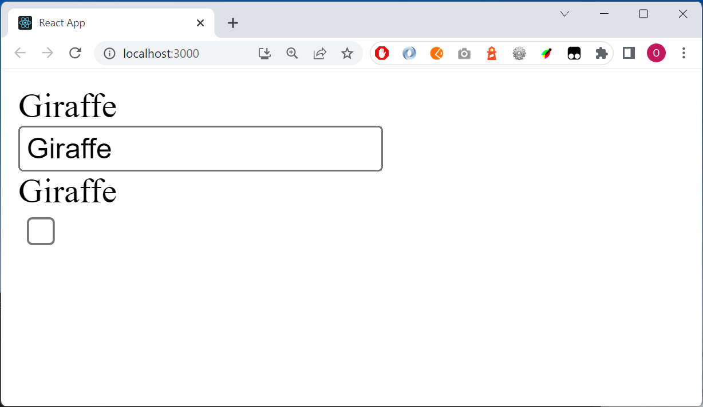

# Checkpoint - React

## Time

2h

## General

Only hand in one file: **Mirror.js** 

Only submit your checkpoint once

Start solving Level 1 (since it's needed to pass Level 2)

You only need to solve Level 1 to pass the checkpoint.

## Level 1

Replace your **index.js** with this code:

    import React from 'react';
    import ReactDOM from 'react-dom/client';

    import Mirror from './checkpoint/Mirror';

    const root = ReactDOM.createRoot(document.getElementById('root'));

    root.render(

    <>
        <Mirror /> 
    </>

    );

Create the component **Mirror.js**

When the page loads, show **Hey** three times. The box in the middle is an input element.

When the user changes the text in the textbox (in the middle), show the same text above and below:

## Level 2

First solve Level 1

The startvalue should be **Hey** by default, but if the a property **start** is supplied, then this value should be the startvalue.

    <Mirror start="Giraffe" /> 

Add a checkbox at the end

If the checkbox is ticked, the text below the textbox should be with dashes inbetween the characters, like this:

Here the user has entered *Panda*:

