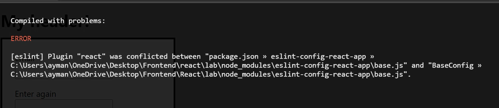
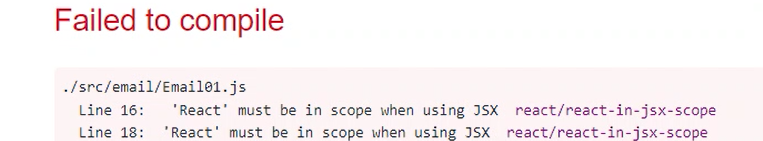
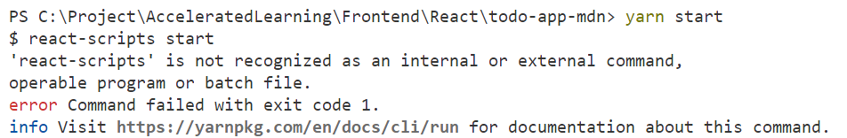

## Problem

When you run
    npx create-react-app lab

you get

    npm ERR! code ENOENT
    npm ERR! syscall lstat
    npm ERR! path C:\Users\yes\AppData\Roaming\npm
    npm ERR! errno -4058
    npm ERR! enoent ENOENT: no such file or directory, lstat 'C:\Users\yes\AppData\Roaming\npm'
    npm ERR! enoent This is related to npm not being able to find a file.
    npm ERR! enoent
    npm ERR! A complete log of this run can be found in:
    npm ERR!     C:\Users\yes\AppData\Local\npm-cache\_logs\2023-07-10T07_37_47_433Z-debug-0.log

## Solution

    npm uninstall -g create-react-app
    npm cache verify

(Maybe need to restart command prompt)

## Problem

    npm ERR! code ENOENT
    npm ERR! syscall open
    npm ERR! path C:\Project\AcceleratedLearning\Frontend\React/package.json
    npm ERR! errno -4058
    npm ERR! enoent ENOENT: no such file or directory, open 'C:\Project\AcceleratedLearning\Frontend\React\package.json'
    npm ERR! enoent This is related to npm not being able to find a file.

## Solution

You're probably in the right folder. Move to the folder where you have the file **package.json** 

## Problem

npm start, gives

	Plugin "react" was conflicted between "package.json...base.js" and "...base.js"

## Solution

Before running 
    
    npm start
    
...look at the casing of the path (c:\MyFOlder\...)

---

## Problem

npm start, gives

	"React" must be in scope when using JSX

## Solution

The error message is not correct. It's Eslint that creates the error. Disable it in config file or add a line in index.js:

    /* eslint "react/jsx-uses-react": "off", "react/react-in-jsx-scope": "off" */

---

## Problem

yarn start, gives

    'react-scripts' is not recognized as an internal or external command

## Solution

Run 

    npm install

## Problem 

    Error: error:0308010C:digital envelope routines::unsupported
        at new Hash (node:internal/crypto/hash:71:19)
        at Object.createHash (node:crypto:133:10)
        at module.exports (C:\Project\AcceleratedLearning\Frontend\React\calculator\node_modules\webpack\lib\util\createHash.js:135:53)

## Solution

Upgrade react-scripts

    npm uninstall react-scripts
    npm install react-scripts    
