# HeadText

Create a folder **basic** and in that folder a component named **HeadText.js**

Replace your **index.js** with this code

    import React from 'react';
    import ReactDOM from 'react-dom/client';

    import HeadText from './basic/HeadText';

    const root = ReactDOM.createRoot(document.getElementById('root'));

    root.render(
    
    <>
        <HeadText/>
    </>

    );

The component should render a header and some text

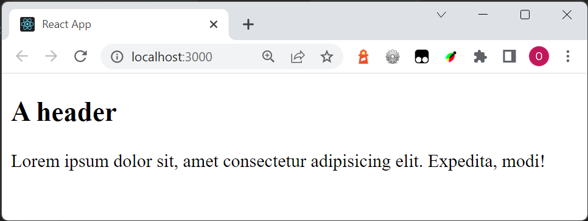

# HeadText2

Create a similar component named HeadText2, but you should be able to change the header and content.

This

    <HeadText2 header="aaaa" content="bbbb" />

should render

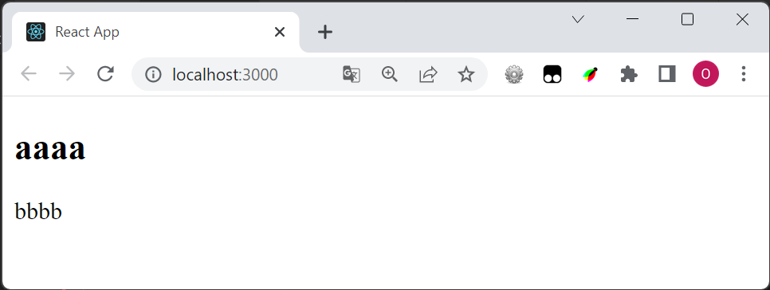

# NameBox

Create a component NameBox which should display a text and a input field where the user can enter some text:

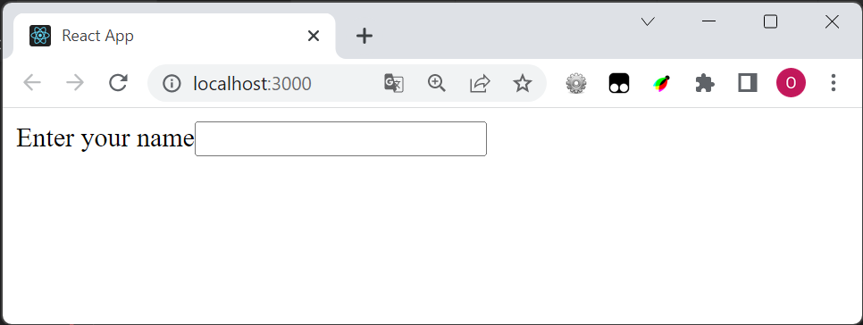

# NumberBox

Create a component which should display a text and a input field where the user can enter **a number**. Use **type=number** in the input element 

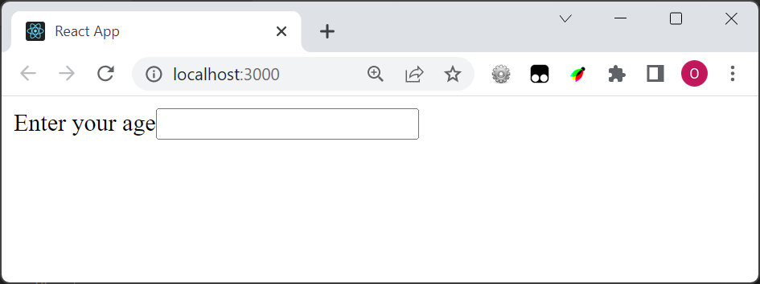

# NumberBox2

Modify the component so you can modify the question. This

    <NumberBox2 question="Your favorite number?" /> 

should render

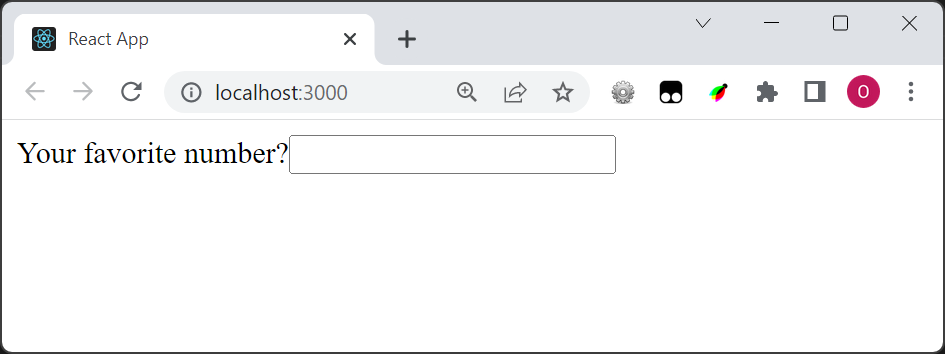

# YesNo

Create a component which should display two button

If the user press the first button display **Yes**

If the user press the second button display **No**

Here the user has pressed the first button and then pressed the second button

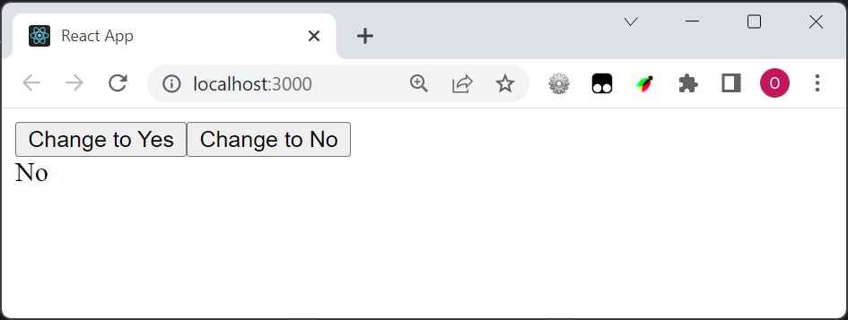

# YesNoToggle

Create a component which should display switch the message below between **Yes** and **No**

At start the component should show **Yes**

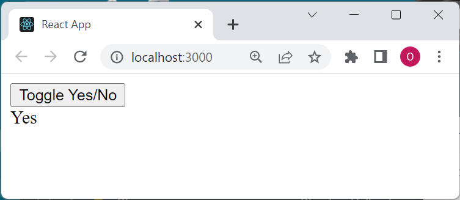

# PowButton

Create a component which should display two buttons, and two texts: Duck and Rabbit. 

If the first button is pressed, replace *Duck* with *POW!*

If the second button is pressed, replace *Rabbit* with *POW!*

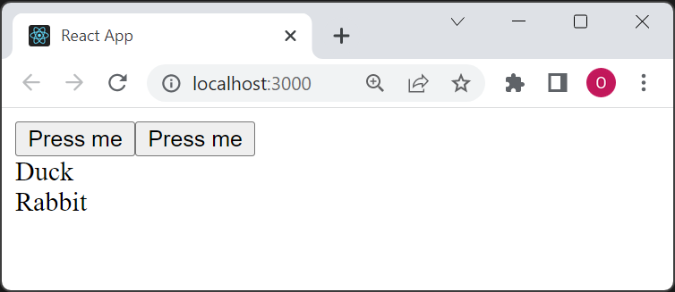

# FollowMe

Create a component which should show an input element.

When the user enter something is the input element, the same text should appear below

Here the user has entered *abc*:

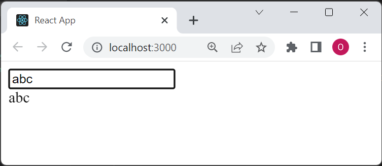

# FollowMe2

Continue with the component and add a button to clear the text

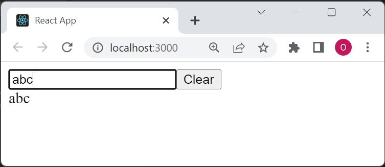

# FollowMe3

Continue with the component and show a message if the text contains five or more characters.

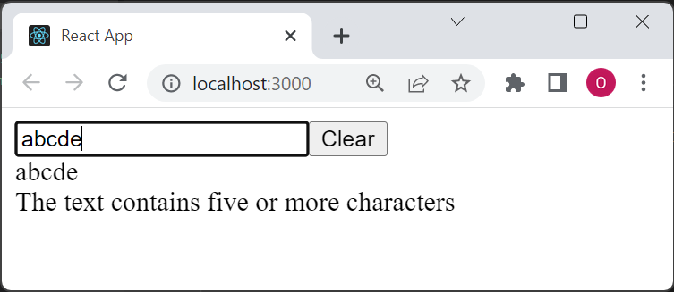

# Selectbox1

Create a select-box with three options: Apple, Banana, Orange

The user choice should change the text at the end

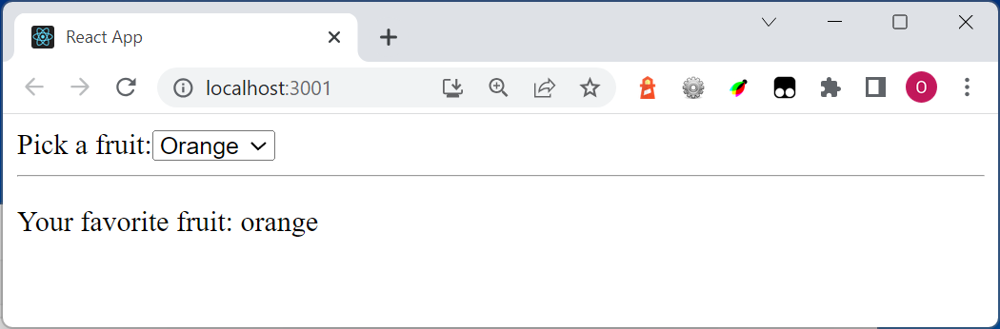

# Checkbox1

If the first checkbox is ticked, show *You like pizza: Yes* (otherwise *No*)

If the second checkbox is ticked, show *You like carrots: Yes* otherwise *No*

If both are ticked, write the text *You are weird* at the end.

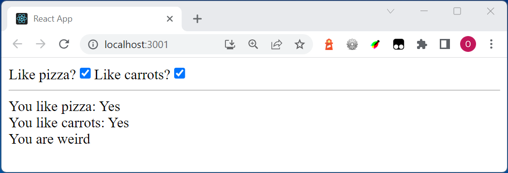
