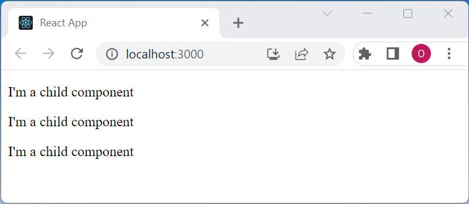
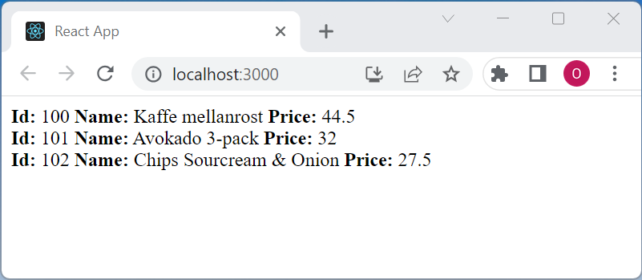
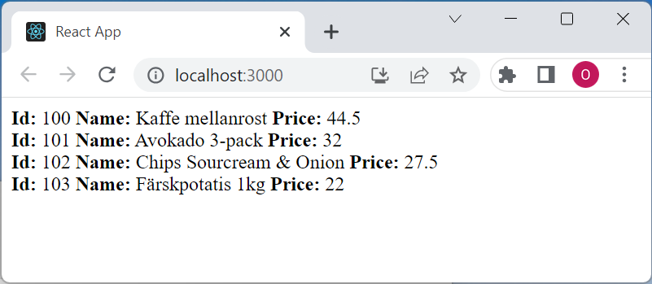
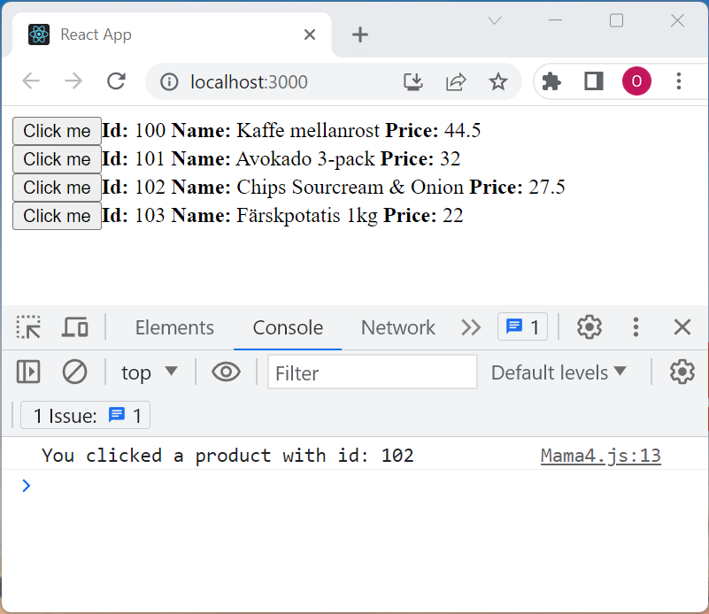

# Mama1

Create a component **Child**  that return a paragraph:

    
I'm a child component

Create a component **Mama** that displays three childs: (hard coded)

# Mama2

Create a component **Product** that can be used like this:

    <Product id={100} name="Kaffe mellanrost" price={44.5} />

Create a component **Mama** that displays three products:

# Mama3

Add a constant that looks something like this:

    const products = [
        {id:100, name:"Kaffe mellanrost", price:44.5}
    ]

In the **Mama** component, use the function **.map** to display four products:

# Mama4

Add a button to the products

When a button is clicked show *You clicked a product with id: ...*, here the user has pressed the product with id 102

